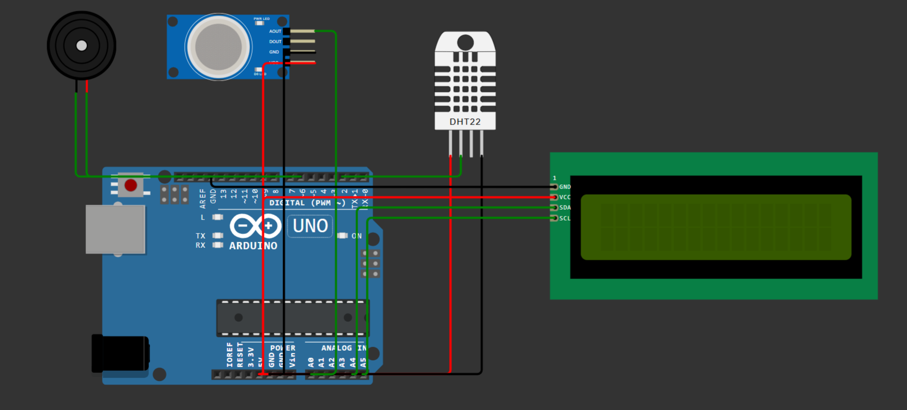

# 🌡️ Arduino Environmenntal Monitoring System

A simple Arduino-based environmental monitoring system that continuously measures **gas concentration, temperature, and humidity**. Sensor readings are displayed on a 16×2 I2C LCD while an active buzzer alerts the user whenever gas levels exceed predefined safety thresholds.

This project demonstrates sensor integration, real-time monitoring, and basic embedded systems programming using Arduino.

---

## ✨ Features

- 🌡️ Real-time temperature monitoring using a DHT22 sensor
- 💧 Humidity monitoring
- 🧪 Gas concentration monitoring using an MQ-2 gas sensor
- 📺 Live readings displayed on a 16×2 I2C LCD
- 🔔 Audible buzzer alerts when gas levels become unsafe
- 🚦 Three air quality levels:
  - ✅ SAFE
  - ⚠️ WARNING
  - 🚨 DANGER
- 💻 Serial Monitor output for debugging and logging

---

## 🛠 Components Used

- Arduino Uno
- DHT22 Temperature & Humidity Sensor
- MQ-2 Gas Sensor
- 16×2 I2C LCD Display
- Active Buzzer
- Jumper Wires

---

## 📷 Circuit



---

## ▶️ Wokwi Simulation

Run the complete project directly in your browser:

👉 **[Open the Interactive Wokwi Simulation](https://wokwi.com/projects/468176955353508865)**

---

## 📂 Project Structure

```
Gas-Monitoring-System/
│
├── Gas_Monitor.ino
├── README.md
└── images/
    └── circuit.png
```

---

## ⚙️ How It Works

1. The DHT22 continuously measures temperature and humidity.
2. The MQ-2 sensor monitors the surrounding gas concentration.
3. Sensor values are displayed on the LCD in real time.
4. Air quality is classified into three categories:
   - SAFE
   - WARNING
   - DANGER
5. If gas levels exceed the danger threshold, the buzzer is activated.
6. Sensor readings are also printed to the Serial Monitor.

---

## 🚀 Future Improvements

- Store sensor readings on an SD card
- Upload data to a cloud dashboard
- Add Wi-Fi support using ESP32
- Send SMS or email alerts when dangerous gas levels are detected
- Display historical sensor trends on a web dashboard

---

This project provides a solid foundation for an embedded environmental monitoring system and can be extended into a complete IoT solution with cloud connectivity, remote monitoring, and real-time alerting.

